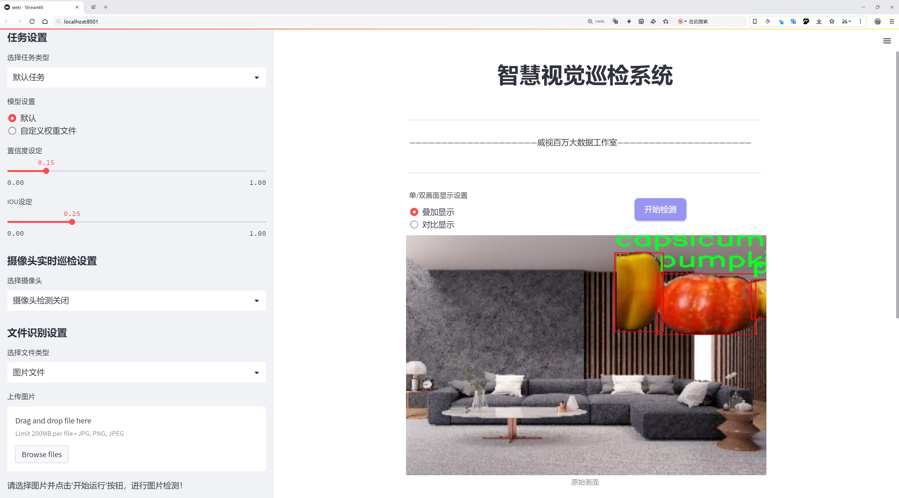
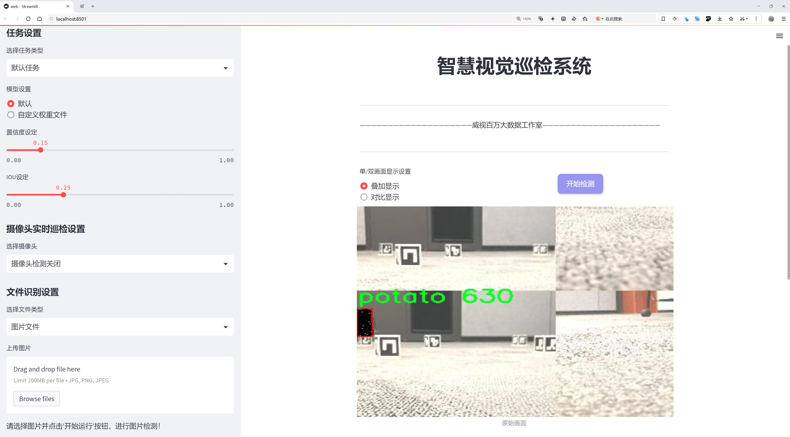
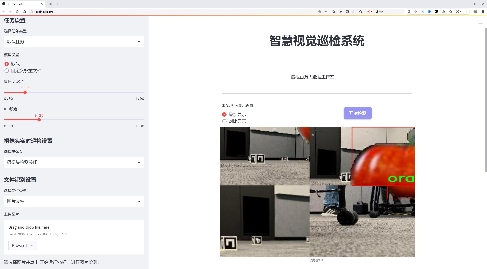
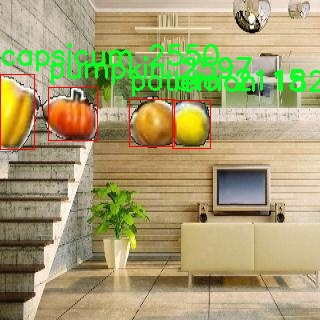
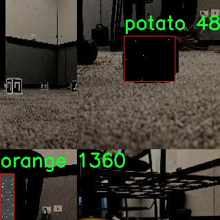
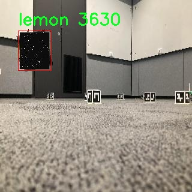
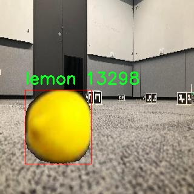
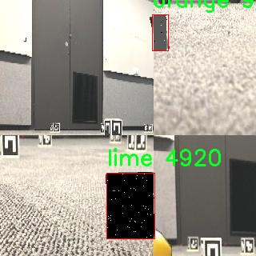

# 水果检测检测系统源码分享
 # [一条龙教学YOLOV8标注好的数据集一键训练_70+全套改进创新点发刊_Web前端展示]

### 1.研究背景与意义

项目参考[AAAI Association for the Advancement of Artificial Intelligence](https://gitee.com/qunmasj/projects)

研究背景与意义

随着全球人口的不断增长和城市化进程的加快，食品安全和农业生产效率问题日益凸显。水果作为人们日常饮食中不可或缺的重要组成部分，其质量和产量直接影响到人们的健康和生活质量。因此，如何高效、准确地对水果进行检测与分类，成为了现代农业与食品工业亟待解决的关键问题之一。传统的水果检测方法往往依赖人工经验，不仅效率低下，而且容易受到主观因素的影响，导致检测结果的不稳定性和不准确性。为此，基于计算机视觉和深度学习技术的自动化水果检测系统应运而生，成为提高水果生产与销售效率的重要手段。

YOLO（You Only Look Once）系列模型因其在目标检测任务中的高效性和准确性而受到广泛关注。YOLOv8作为该系列的最新版本，进一步提升了检测速度和精度，尤其在复杂背景下的目标识别能力上表现优异。然而，尽管YOLOv8在许多应用场景中表现出色，但在特定领域如水果检测中，仍然存在一些挑战。例如，水果在不同生长阶段、不同光照条件和不同背景下的外观变化，可能导致模型的检测性能下降。因此，针对水果检测任务对YOLOv8进行改进，能够有效提升其在实际应用中的表现。

本研究将基于改进YOLOv8的水果检测系统，利用包含9868张图像和8个类别（包括辣椒、大蒜、柠檬、青柠、橙子、土豆、南瓜和西红柿）的数据集进行训练和测试。该数据集的多样性和丰富性为模型的训练提供了良好的基础，使其能够学习到不同水果的特征，从而提高检测的准确性和鲁棒性。通过对YOLOv8模型的改进，我们将探索如何在不同的光照条件、不同的背景和不同的水果状态下，提升模型的检测性能，进而实现高效的水果分类和识别。

本研究的意义不仅在于推动水果检测技术的发展，更在于为农业生产和食品安全提供切实可行的解决方案。通过实现自动化的水果检测系统，可以有效减少人工成本，提高生产效率，降低人为错误的发生率。同时，该系统的应用还可以为农产品的质量追溯提供数据支持，增强消费者对食品安全的信任。此外，改进后的YOLOv8模型也可以为其他领域的目标检测任务提供借鉴，具有广泛的应用前景。

综上所述，基于改进YOLOv8的水果检测系统的研究，不仅具有重要的理论价值，还有助于推动农业智能化和现代化进程，为实现可持续发展目标贡献力量。通过这一研究，我们期望能够为水果检测领域提供新的思路和方法，推动相关技术的进步与应用。

### 2.图片演示







##### 注意：由于此博客编辑较早，上面“2.图片演示”和“3.视频演示”展示的系统图片或者视频可能为老版本，新版本在老版本的基础上升级如下：（实际效果以升级的新版本为准）

  （1）适配了YOLOV8的“目标检测”模型和“实例分割”模型，通过加载相应的权重（.pt）文件即可自适应加载模型。

  （2）支持“图片识别”、“视频识别”、“摄像头实时识别”三种识别模式。

  （3）支持“图片识别”、“视频识别”、“摄像头实时识别”三种识别结果保存导出，解决手动导出（容易卡顿出现爆内存）存在的问题，识别完自动保存结果并导出到。

  （4）支持Web前端系统中的标题、背景图等自定义修改，后面提供修改教程。

  另外本项目提供训练的数据集和训练教程,暂不提供权重文件（best.pt）,需要您按照教程进行训练后实现图片演示和Web前端界面演示的效果。

### 3.视频演示

[3.1 视频演示](https://www.bilibili.com/video/BV1ckWfeXE86/?vd_source=ff015de2d29cbe2a9cdbfa7064407a08)

### 4.数据集信息展示

数据集信息展示

本数据集名为“fruit”，专为改进YOLOv8的水果检测系统而设计，旨在提升计算机视觉领域中对多种水果和蔬菜的识别能力。该数据集包含总计9868张高质量图像，涵盖了8个不同的类别，具体包括：辣椒（capsicum）、大蒜（garlic）、柠檬（lemon）、青柠（lime）、橙子（orange）、土豆（potato）、南瓜（pumpkin）和西红柿（tomato）。这些类别的选择不仅考虑了水果和蔬菜的多样性，还旨在为训练模型提供丰富的样本，以提高其在实际应用中的准确性和鲁棒性。

数据集中每个类别的图像均经过精心挑选，确保了多样性和代表性。图像的拍摄环境各异，包括自然光照和人工光源，背景也有多种变化，从而使得模型在训练过程中能够学习到不同的特征和模式。这种多样性对于提高模型在现实世界中应用的适应性至关重要，尤其是在不同的光照和背景条件下，能够有效减少模型的过拟合现象。

此外，数据集的构建遵循了CC BY 4.0的许可协议，确保了用户在使用该数据集时可以进行适当的引用和再利用。这一许可不仅促进了学术界和工业界的合作与共享，也为研究人员提供了一个良好的基础，以便在此基础上进行进一步的研究和开发。

在使用YOLOv8进行水果检测时，该数据集的丰富性和多样性将极大地提升模型的性能。YOLOv8作为一种先进的目标检测模型，能够实时处理图像并进行高效的对象识别，而“fruit”数据集的引入将使其在识别各种水果和蔬菜时更加精准。通过对9868张图像的训练，模型将能够学习到每种类别的独特特征，从而在实际应用中实现更高的检测精度。

值得注意的是，数据集中的每个类别均具有不同的特征和挑战。例如，辣椒和西红柿在形状和颜色上可能存在相似之处，而大蒜和土豆则在外观上有显著差异。这种复杂性为模型的训练提供了丰富的场景，使得最终的检测系统不仅能够识别出水果的种类，还能在面对相似物体时保持高效的区分能力。

综上所述，“fruit”数据集为改进YOLOv8的水果检测系统提供了坚实的基础。通过对多样化图像的训练，模型将能够在实际应用中表现出色，适应不同的环境和条件，满足现代农业、食品安全及智能零售等领域对高效水果检测的需求。随着计算机视觉技术的不断进步，该数据集的应用前景广阔，将为相关研究和实际应用提供重要支持。











### 5.全套项目环境部署视频教程（零基础手把手教学）

[5.1 环境部署教程链接（零基础手把手教学）](https://www.ixigua.com/7404473917358506534?logTag=c807d0cbc21c0ef59de5)


[5.2 安装Python虚拟环境创建和依赖库安装视频教程链接（零基础手把手教学）](https://www.ixigua.com/7404474678003106304?logTag=1f1041108cd1f708b01a)

### 6.手把手YOLOV8训练视频教程（零基础小白有手就能学会）

[6.1 环境部署教程链接（零基础手把手教学）](https://www.ixigua.com/7404477157818401292?logTag=d31a2dfd1983c9668658)

### 7.70+种全套YOLOV8创新点代码加载调参视频教程（一键加载写好的改进模型的配置文件）

[7.1 环境部署教程链接（零基础手把手教学）](https://www.ixigua.com/7404478314661806627?logTag=29066f8288e3f4eea3a4)

### 8.70+种全套YOLOV8创新点原理讲解（非科班也可以轻松写刊发刊，V10版本正在科研待更新）

由于篇幅限制，每个创新点的具体原理讲解就不一一展开，具体见下列网址中的创新点对应子项目的技术原理博客网址【Blog】：


[8.1 70+种全套YOLOV8创新点原理讲解链接](https://gitee.com/qunmasj/good)

### 9.系统功能展示（检测对象为举例，实际内容以本项目数据集为准）

图1.系统支持检测结果表格显示

  图2.系统支持置信度和IOU阈值手动调节

  图3.系统支持自定义加载权重文件best.pt(需要你通过步骤5中训练获得)

  图4.系统支持摄像头实时识别

  图5.系统支持图片识别

  图6.系统支持视频识别

  图7.系统支持识别结果文件自动保存

  图8.系统支持Excel导出检测结果数据


### 10.原始YOLOV8算法原理

原始YOLOv8算法原理

YOLOv8算法是目标检测领域的一项重要进展，由Glenn-Jocher提出，继承了YOLO系列算法的优良传统，尤其是YOLOv3和YOLOv5的设计理念。YOLOv8的核心目标是实现更高效、更精确的目标检测，尤其是在多尺度目标检测方面，展现出其独特的优势。该算法的设计不仅考虑了性能的提升，还注重了模型的灵活性和可扩展性，使得其在不同应用场景中都能表现出色。

YOLOv8的网络结构分为三个主要部分：Backbone、Neck和Head。Backbone部分负责特征提取，采用了一系列卷积和反卷积层，结合残差连接和瓶颈结构，旨在减小网络的复杂度并提升性能。具体而言，YOLOv8引入了C2模块作为基本构成单元，构建了一个由5个CBS模块、4个C2f模块和1个快速空间金字塔池化(SPPF)模块组成的Backbone。这种设计使得网络在提取特征时，能够有效捕捉到不同层次的特征信息，从而为后续的目标检测任务奠定了坚实的基础。

在Neck部分，YOLOv8采用了多尺度特征融合技术，将来自Backbone不同阶段的特征图进行融合，以便更好地捕捉不同尺度目标的信息。这一过程通过特征金字塔网络(FPN)和路径聚合网络(PAN)的结合实现，充分利用了多层次的特征信息，增强了模型对各种目标的检测能力和鲁棒性。通过这种结构，YOLOv8能够在处理不同尺寸的目标时，保持较高的检测精度。

Head部分则负责最终的目标检测和分类任务。YOLOv8的Head结构采用了解耦合的设计理念，设有三个检测头，分别用于在不同尺寸信息下检测目标。这种解耦合的设计使得分类和定位任务可以独立进行，提升了模型的灵活性和准确性。检测头内部包含一系列卷积层和反卷积层，旨在生成最终的检测结果。通过这种结构，YOLOv8能够更好地处理复杂场景中的目标检测任务。

在数据预处理方面，YOLOv8延续了YOLOv5的策略，采用了包括马赛克增强、混合增强、空间扰动和颜色扰动等多种增强手段。这些数据增强技术不仅丰富了训练数据的多样性，还提高了模型的泛化能力，使得YOLOv8在面对复杂环境时，依然能够保持较高的检测性能。

YOLOv8的骨干网络结构在YOLOv5的基础上进行了改进，原有的C3模块被新的C2f模块所替代。C2f模块引入了更多的分支，丰富了梯度回传时的支流，从而提升了网络的学习能力。这种改进使得YOLOv8在特征提取过程中，能够更有效地捕捉到重要的特征信息，进而提高目标检测的精度。

在标签分配策略方面，YOLOv8摒弃了传统的候选框策略，采用了动态标签分配策略TOOD。这一策略通过优化正负样本的匹配，提升了模型在多尺度目标检测中的表现。YOLOv8的损失函数设计也进行了创新，分类损失采用了VFL Loss，而回归损失则结合了CIoULoss与DFLLoss。这种损失函数的设计使得模型在训练过程中，能够更好地关注高质量的正样本，从而提升整体的检测性能。

总的来说，YOLOv8算法通过对网络结构的优化、数据处理的改进以及损失函数的创新，展现出了卓越的目标检测能力。其灵活的模型设计和高效的特征提取能力，使得YOLOv8在实际应用中能够应对各种复杂的目标检测任务，成为目标检测领域的一项重要工具。随着YOLOv8的不断发展和完善，未来在更多应用场景中的表现值得期待。


### 11.项目核心源码讲解（再也不用担心看不懂代码逻辑）

#### 11.1 ultralytics\engine\trainer.py

以下是对代码中最核心部分的提炼和详细中文注释：

```python
class BaseTrainer:
    """
    BaseTrainer 类用于训练模型的基础类。

    属性:
        args (SimpleNamespace): 训练配置参数。
        model (nn.Module): 模型实例。
        device (torch.device): 训练所用的设备。
        trainset (torch.utils.data.Dataset): 训练数据集。
        testset (torch.utils.data.Dataset): 测试数据集。
        optimizer (torch.optim.Optimizer): 优化器实例。
        epochs (int): 训练的总轮数。
        best_fitness (float): 训练过程中最佳的适应度值。
    """

    def __init__(self, cfg=DEFAULT_CFG, overrides=None):
        """
        初始化 BaseTrainer 类。

        参数:
            cfg (str, optional): 配置文件路径，默认为 DEFAULT_CFG。
            overrides (dict, optional): 配置覆盖，默认为 None。
        """
        self.args = get_cfg(cfg, overrides)  # 获取配置
        self.device = select_device(self.args.device, self.args.batch)  # 选择设备
        self.model = check_model_file_from_stem(self.args.model)  # 检查模型文件
        self.trainset, self.testset = self.get_dataset(self.args.data)  # 获取训练和测试数据集
        self.optimizer = self.build_optimizer(self.model)  # 构建优化器
        self.epochs = self.args.epochs  # 设置训练轮数
        self.best_fitness = None  # 初始化最佳适应度

    def train(self):
        """开始训练过程。"""
        for epoch in range(self.epochs):
            self.model.train()  # 设置模型为训练模式
            for batch in self.train_loader:  # 遍历训练数据
                self.optimizer.zero_grad()  # 清空梯度
                loss = self.model(batch)  # 前向传播计算损失
                loss.backward()  # 反向传播计算梯度
                self.optimizer.step()  # 更新模型参数

            # 在每个 epoch 结束后进行验证
            metrics, fitness = self.validate()
            if self.best_fitness is None or fitness > self.best_fitness:
                self.best_fitness = fitness  # 更新最佳适应度

    def validate(self):
        """在测试集上进行验证并返回指标。"""
        self.model.eval()  # 设置模型为评估模式
        with torch.no_grad():  # 不计算梯度
            for batch in self.testset:  # 遍历测试数据
                # 计算验证损失和其他指标
                pass  # 具体实现略

    def build_optimizer(self, model):
        """为模型构建优化器。"""
        optimizer = optim.Adam(model.parameters(), lr=self.args.lr)  # 使用 Adam 优化器
        return optimizer

    @staticmethod
    def get_dataset(data):
        """
        从数据字典中获取训练和验证路径。

        返回:
            训练集和验证集路径。
        """
        return data["train"], data.get("val") or data.get("test")
```

### 代码分析和注释说明：

1. **类的定义**：
   - `BaseTrainer` 类是一个基础训练类，负责模型的训练和验证。

2. **初始化方法**：
   - `__init__` 方法中初始化了训练的配置、设备选择、模型检查、数据集获取和优化器构建。

3. **训练方法**：
   - `train` 方法负责执行训练过程，包含了每个 epoch 的训练和验证逻辑。

4. **验证方法**：
   - `validate` 方法在测试集上进行模型验证，计算损失和其他指标。

5. **优化器构建**：
   - `build_optimizer` 方法根据模型参数构建优化器，这里使用了 Adam 优化器。

6. **数据集获取**：
   - `get_dataset` 方法从给定的数据字典中提取训练和验证集路径。

### 总结：
以上代码片段展示了一个基础的训练框架，包含了模型训练、验证和优化器构建的核心逻辑。通过详细的中文注释，便于理解每个部分的功能和实现方式。

这个文件是Ultralytics YOLO（You Only Look Once）模型的训练引擎，主要用于在给定数据集上训练YOLO模型。文件中定义了一个名为`BaseTrainer`的类，作为训练的基础类，包含了模型训练所需的各种方法和属性。

在类的初始化方法中，首先通过`get_cfg`函数获取配置参数，并根据需要进行恢复训练的检查。接着，选择训练所用的设备（如CPU或GPU），并设置一些基本的目录结构以保存训练结果和权重。初始化过程中还会加载数据集，并检查数据集的有效性。

`BaseTrainer`类中定义了多个方法，其中包括训练的主要逻辑`train`，它会根据设备的数量选择合适的训练方式。如果是多GPU训练，会生成相应的命令并通过子进程执行分布式训练。训练过程中，模型会在每个epoch中进行前向传播、计算损失、反向传播和优化步骤。训练的进度会通过日志记录，并在每个epoch结束时进行验证。

该类还包含了学习率调度器的设置、优化器的构建、模型的保存和恢复等功能。训练过程中，模型的状态会定期保存，以便在训练中断时可以恢复。训练结束后，会进行最终的评估，并根据需要绘制训练过程中的各种指标。

此外，`BaseTrainer`类还支持回调机制，可以在训练的不同阶段触发特定的回调函数，方便用户进行自定义操作，比如记录日志、保存模型等。

总的来说，这个文件实现了YOLO模型训练的核心逻辑，提供了灵活的配置和扩展能力，适用于各种计算机视觉任务。

#### 11.2 ultralytics\engine\exporter.py

以下是经过简化并添加详细中文注释的代码核心部分：

```python
import torch
from ultralytics.utils import select_device, check_imgsz, check_class_names, default_class_names

class Exporter:
    """
    导出模型的类。
    
    属性:
        args (SimpleNamespace): 导出器的配置。
        callbacks (list, optional): 回调函数列表。默认为 None。
    """

    def __init__(self, cfg=DEFAULT_CFG, overrides=None, _callbacks=None):
        """
        初始化 Exporter 类。

        参数:
            cfg (str, optional): 配置文件路径。默认为 DEFAULT_CFG。
            overrides (dict, optional): 配置覆盖。默认为 None。
            _callbacks (dict, optional): 回调函数字典。默认为 None。
        """
        self.args = get_cfg(cfg, overrides)  # 获取配置
        self.callbacks = _callbacks or callbacks.get_default_callbacks()  # 设置回调函数

    def __call__(self, model=None):
        """运行导出过程并返回导出文件/目录列表。"""
        # 运行导出开始的回调
        self.run_callbacks("on_export_start")
        
        fmt = self.args.format.lower()  # 将格式转换为小写
        self.device = select_device("cpu" if self.args.device is None else self.args.device)  # 选择设备
        
        # 检查模型类名
        if not hasattr(model, "names"):
            model.names = default_class_names()
        model.names = check_class_names(model.names)  # 检查类名
        
        self.imgsz = check_imgsz(self.args.imgsz, stride=model.stride, min_dim=2)  # 检查图像大小
        
        # 创建输入张量
        im = torch.zeros(self.args.batch, 3, *self.imgsz).to(self.device)
        
        # 更新模型
        model = model.to(self.device).eval()  # 将模型转移到设备并设置为评估模式
        for p in model.parameters():
            p.requires_grad = False  # 不需要梯度
        
        # 进行干运行以确保模型正常工作
        for _ in range(2):
            model(im)  # 干运行
        
        # 导出模型
        f = self.export_onnx()  # 导出为 ONNX 格式
        return f  # 返回导出的文件

    def export_onnx(self):
        """导出为 ONNX 格式。"""
        f = str(self.file.with_suffix(".onnx"))  # 设置导出文件名
        torch.onnx.export(
            self.model.cpu(),  # 将模型转移到 CPU
            self.im.cpu(),  # 将输入转移到 CPU
            f,  # 导出文件名
            input_names=["images"],  # 输入名称
            output_names=["output0"],  # 输出名称
            dynamic_axes={"images": {0: "batch", 2: "height", 3: "width"}}  # 动态轴
        )
        return f  # 返回导出的文件名

    def run_callbacks(self, event: str):
        """执行给定事件的所有回调。"""
        for callback in self.callbacks.get(event, []):
            callback(self)  # 运行每个回调
```

### 代码说明：
1. **类 `Exporter`**：用于导出 YOLO 模型的类，包含初始化和导出方法。
2. **`__init__` 方法**：初始化导出器，获取配置和回调函数。
3. **`__call__` 方法**：运行导出过程，选择设备，检查模型和图像大小，并进行干运行。
4. **`export_onnx` 方法**：将模型导出为 ONNX 格式，设置输入输出名称和动态轴。
5. **`run_callbacks` 方法**：执行与导出过程相关的回调函数。 

该代码段保留了导出模型的核心逻辑，并添加了详细的中文注释，以便于理解每个部分的功能。

这个程序文件 `ultralytics/engine/exporter.py` 是用于将 YOLOv8 模型导出为多种格式的工具。YOLO（You Only Look Once）是一种流行的目标检测模型，而这个文件提供了将训练好的 YOLOv8 模型转换为不同框架和格式的功能，以便在不同的环境中使用。

文件的开头部分列出了支持的导出格式，包括 PyTorch、TorchScript、ONNX、OpenVINO、TensorRT、CoreML、TensorFlow SavedModel、TensorFlow GraphDef、TensorFlow Lite、TensorFlow Edge TPU、TensorFlow.js、PaddlePaddle 和 ncnn。这些格式可以满足不同的需求，比如在移动设备、嵌入式系统或云服务上运行模型。

程序的核心是 `Exporter` 类，它负责处理模型的导出。初始化时，`Exporter` 类会加载配置，并根据需要设置回调函数。调用 `__call__` 方法时，会根据用户指定的格式执行相应的导出操作。这个方法首先会检查导出格式的有效性，然后根据格式选择合适的导出函数。

在导出过程中，程序会进行一系列的检查和准备工作，包括确认模型的设备（CPU 或 GPU）、检查输入图像的大小、处理模型参数等。然后，它会根据不同的格式调用相应的导出函数，如 `export_torchscript`、`export_onnx`、`export_engine` 等。

每个导出函数负责将模型转换为特定格式，并保存到文件中。例如，`export_onnx` 函数会使用 ONNX 库将模型导出为 ONNX 格式，并可以选择性地简化模型。`export_tflite` 函数则负责将模型导出为 TensorFlow Lite 格式，适合在移动设备上使用。

此外，程序还提供了一些辅助功能，比如添加元数据到导出的模型中，以便于后续的使用和管理。元数据包括模型的描述、作者、许可证、版本等信息，这些信息会被保存到导出的文件中。

总的来说，这个文件是一个功能强大的工具，旨在简化 YOLOv8 模型的导出过程，使得用户能够方便地将模型转换为多种格式，以适应不同的应用场景。

#### 11.3 ui.py

```python
import sys
import subprocess

def run_script(script_path):
    """
    使用当前 Python 环境运行指定的脚本。

    Args:
        script_path (str): 要运行的脚本路径

    Returns:
        None
    """
    # 获取当前 Python 解释器的路径
    python_path = sys.executable

    # 构建运行命令，使用 streamlit 运行指定的脚本
    command = f'"{python_path}" -m streamlit run "{script_path}"'

    # 执行命令并等待其完成
    result = subprocess.run(command, shell=True)
    
    # 检查命令执行的返回码，如果不为0则表示出错
    if result.returncode != 0:
        print("脚本运行出错。")


# 实例化并运行应用
if __name__ == "__main__":
    # 指定要运行的脚本路径
    script_path = "web.py"  # 这里可以直接指定脚本名

    # 调用函数运行脚本
    run_script(script_path)
```

### 代码注释说明：
1. **导入模块**：
   - `sys`：用于访问与 Python 解释器相关的变量和函数。
   - `subprocess`：用于执行外部命令。

2. **`run_script` 函数**：
   - 定义一个函数 `run_script`，接收一个参数 `script_path`，表示要运行的脚本路径。
   - 使用 `sys.executable` 获取当前 Python 解释器的路径，以确保使用正确的 Python 环境。
   - 构建一个命令字符串，使用 `streamlit` 模块运行指定的脚本。
   - 使用 `subprocess.run` 执行构建的命令，并等待其完成。
   - 检查命令的返回码，如果返回码不为0，表示脚本运行出错，打印错误信息。

3. **主程序部分**：
   - 使用 `if __name__ == "__main__":` 确保只有在直接运行该脚本时才会执行以下代码。
   - 指定要运行的脚本路径（在这里是 `web.py`）。
   - 调用 `run_script` 函数，传入脚本路径以运行该脚本。

这个程序文件的主要功能是通过当前的 Python 环境来运行一个指定的脚本，具体来说是一个名为 `web.py` 的脚本。程序首先导入了必要的模块，包括 `sys`、`os` 和 `subprocess`，以及一个自定义的 `abs_path` 函数，这个函数可能用于获取文件的绝对路径。

在 `run_script` 函数中，首先获取当前 Python 解释器的路径，使用 `sys.executable` 来实现。接着，构建一个命令字符串，该命令使用 `streamlit` 模块来运行指定的脚本。`streamlit` 是一个用于构建数据应用的库，通常用于快速创建交互式的 Web 应用。

构建好命令后，程序使用 `subprocess.run` 来执行这个命令。`shell=True` 参数允许在 shell 中执行命令。执行后，程序会检查返回的状态码，如果状态码不为 0，表示脚本运行出错，此时会打印出错误信息。

在文件的最后部分，使用 `if __name__ == "__main__":` 来确保只有在直接运行该文件时才会执行下面的代码。这里指定了要运行的脚本路径为 `web.py`，并调用 `run_script` 函数来执行这个脚本。

总体来看，这个程序的设计旨在提供一个简单的接口，通过 Python 环境来运行一个特定的脚本，方便用户进行数据应用的开发和测试。

#### 11.4 ultralytics\models\rtdetr\val.py

以下是代码中最核心的部分，并附上详细的中文注释：

```python
import torch
from ultralytics.data import YOLODataset
from ultralytics.models.yolo.detect import DetectionValidator
from ultralytics.utils import ops

class RTDETRDataset(YOLODataset):
    """
    RT-DETR数据集类，继承自YOLODataset类。
    该类专为RT-DETR目标检测模型设计，优化了实时检测和跟踪任务。
    """

    def __init__(self, *args, data=None, **kwargs):
        """初始化RTDETRDataset类，调用父类的初始化方法。"""
        super().__init__(*args, data=data, **kwargs)

    def load_image(self, i, rect_mode=False):
        """从数据集中加载索引为'i'的图像，返回图像及其调整后的尺寸。"""
        return super().load_image(i=i, rect_mode=rect_mode)

    def build_transforms(self, hyp=None):
        """构建图像转换操作，仅用于评估阶段。"""
        if self.augment:
            # 根据是否进行增强，设置mosaic和mixup的参数
            hyp.mosaic = hyp.mosaic if self.augment and not self.rect else 0.0
            hyp.mixup = hyp.mixup if self.augment and not self.rect else 0.0
            transforms = v8_transforms(self, self.imgsz, hyp, stretch=True)
        else:
            transforms = Compose([])  # 如果没有增强，则不进行任何转换

        # 添加格式化转换
        transforms.append(
            Format(
                bbox_format="xywh",  # 边界框格式为xywh
                normalize=True,  # 归一化
                return_mask=self.use_segments,  # 是否返回分割掩码
                return_keypoint=self.use_keypoints,  # 是否返回关键点
                batch_idx=True,  # 返回批次索引
                mask_ratio=hyp.mask_ratio,  # 掩码比例
                mask_overlap=hyp.overlap_mask,  # 掩码重叠
            )
        )
        return transforms


class RTDETRValidator(DetectionValidator):
    """
    RTDETRValidator类扩展了DetectionValidator类，提供专门针对RT-DETR模型的验证功能。
    该类允许构建RTDETR特定的数据集进行验证，应用非极大值抑制进行后处理，并相应更新评估指标。
    """

    def build_dataset(self, img_path, mode="val", batch=None):
        """
        构建RTDETR数据集。

        参数:
            img_path (str): 包含图像的文件夹路径。
            mode (str): 模式，可以是'train'或'val'，用户可以为每种模式自定义不同的增强。
            batch (int, optional): 批次大小，仅用于'rect'模式。默认为None。
        """
        return RTDETRDataset(
            img_path=img_path,
            imgsz=self.args.imgsz,
            batch_size=batch,
            augment=False,  # 不进行增强
            hyp=self.args,
            rect=False,  # 不进行矩形调整
            cache=self.args.cache or None,
            prefix=colorstr(f"{mode}: "),
            data=self.data,
        )

    def postprocess(self, preds):
        """对预测输出应用非极大值抑制。"""
        bs, _, nd = preds[0].shape  # 获取批次大小、通道数和预测框数量
        bboxes, scores = preds[0].split((4, nd - 4), dim=-1)  # 分离边界框和分数
        bboxes *= self.args.imgsz  # 将边界框缩放到原始图像大小
        outputs = [torch.zeros((0, 6), device=bboxes.device)] * bs  # 初始化输出

        for i, bbox in enumerate(bboxes):  # 遍历每个边界框
            bbox = ops.xywh2xyxy(bbox)  # 将xywh格式转换为xyxy格式
            score, cls = scores[i].max(-1)  # 获取每个边界框的最大分数和类别
            pred = torch.cat([bbox, score[..., None], cls[..., None]], dim=-1)  # 合并边界框、分数和类别
            pred = pred[score.argsort(descending=True)]  # 按照分数排序
            outputs[i] = pred  # 存储输出

        return outputs

    def _prepare_batch(self, si, batch):
        """准备训练或推理的批次，应用转换操作。"""
        idx = batch["batch_idx"] == si  # 获取当前批次的索引
        cls = batch["cls"][idx].squeeze(-1)  # 获取类别
        bbox = batch["bboxes"][idx]  # 获取边界框
        ori_shape = batch["ori_shape"][si]  # 获取原始图像形状
        imgsz = batch["img"].shape[2:]  # 获取图像尺寸
        ratio_pad = batch["ratio_pad"][si]  # 获取填充比例

        if len(cls):
            bbox = ops.xywh2xyxy(bbox)  # 转换目标框格式
            bbox[..., [0, 2]] *= ori_shape[1]  # 转换为原始空间
            bbox[..., [1, 3]] *= ori_shape[0]  # 转换为原始空间

        return dict(cls=cls, bbox=bbox, ori_shape=ori_shape, imgsz=imgsz, ratio_pad=ratio_pad)

    def _prepare_pred(self, pred, pbatch):
        """准备并返回带有转换后的边界框和类别标签的批次。"""
        predn = pred.clone()  # 克隆预测
        predn[..., [0, 2]] *= pbatch["ori_shape"][1] / self.args.imgsz  # 转换为原始空间
        predn[..., [1, 3]] *= pbatch["ori_shape"][0] / self.args.imgsz  # 转换为原始空间
        return predn.float()  # 返回浮点型预测
```

### 代码核心部分说明：
1. **RTDETRDataset类**：该类是RT-DETR模型的数据集类，继承自YOLODataset，主要负责加载图像和构建数据转换。
2. **load_image方法**：用于加载特定索引的图像。
3. **build_transforms方法**：构建数据增强和格式化的转换操作。
4. **RTDETRValidator类**：该类扩展了DetectionValidator，专门用于RT-DETR模型的验证，提供了构建数据集、后处理预测和准备批次的方法。
5. **postprocess方法**：对模型的预测结果进行非极大值抑制，确保最终输出的边界框是有效的。
6. **_prepare_batch和_prepare_pred方法**：用于准备训练或推理的批次数据和预测结果，确保数据格式正确并转换为原始空间。

该程序文件是用于RT-DETR（实时检测与跟踪）模型的验证过程，继承自Ultralytics YOLO框架。文件中主要定义了两个类：`RTDETRDataset`和`RTDETRValidator`，它们分别用于数据集的构建和模型验证。

`RTDETRDataset`类是对YOLODataset类的扩展，专门为RT-DETR模型设计，优化了实时检测和跟踪任务。该类的构造函数调用了父类的构造函数，并重写了`load_image`方法，以便加载图像时支持RT-DETR的马赛克处理。`build_transforms`方法用于构建数据增强变换，主要用于评估阶段。根据传入的超参数（hyp），该方法会决定是否应用马赛克和混合增强，并返回相应的变换组合。

`RTDETRValidator`类继承自DetectionValidator，提供了专门针对RT-DETR模型的验证功能。它的`build_dataset`方法用于构建RT-DETR数据集，允许用户自定义不同模式（训练或验证）的数据增强。`postprocess`方法实现了非极大值抑制（NMS），用于处理模型的预测输出，以减少冗余的边界框。该方法将预测的边界框和得分分开，并根据得分进行排序，最终返回处理后的输出。

此外，`_prepare_batch`和`_prepare_pred`方法分别用于准备训练或推理的批次数据，以及处理和返回经过变换的边界框和类别标签。这些方法确保了模型在验证过程中能够正确地处理输入数据和输出结果。

整体来看，该文件为RT-DETR模型的验证提供了必要的工具和方法，确保了模型在实时检测和跟踪任务中的有效性和准确性。

#### 11.5 train.py

以下是经过简化和注释的核心代码部分：

```python
import os
import torch
import yaml
from ultralytics import YOLO  # 导入YOLO模型库
from QtFusion.path import abs_path  # 导入路径处理工具

# 确定使用的设备，优先使用GPU
device = "0" if torch.cuda.is_available() else "cpu"

if __name__ == '__main__':  # 确保该模块被直接运行时才执行以下代码
    workers = 1  # 设置数据加载的工作进程数
    batch = 2    # 设置每个批次的大小

    data_name = "data"  # 数据集名称
    # 获取数据集配置文件的绝对路径
    data_path = abs_path(f'datasets/{data_name}/{data_name}.yaml', path_type='current')  
    unix_style_path = data_path.replace(os.sep, '/')  # 将路径转换为Unix风格

    # 获取数据集目录路径
    directory_path = os.path.dirname(unix_style_path)
    
    # 读取YAML文件，保持原有顺序
    with open(data_path, 'r') as file:
        data = yaml.load(file, Loader=yaml.FullLoader)
    
    # 如果YAML文件中包含'path'项，则修改为当前目录路径
    if 'path' in data:
        data['path'] = directory_path
        # 将修改后的数据写回YAML文件
        with open(data_path, 'w') as file:
            yaml.safe_dump(data, file, sort_keys=False)

    # 加载YOLOv8模型配置
    model = YOLO(model='./ultralytics/cfg/models/v8/yolov8s.yaml', task='detect')  
    
    # 开始训练模型
    results2 = model.train(
        data=data_path,  # 指定训练数据的配置文件路径
        device=device,  # 指定使用的设备
        workers=workers,  # 指定数据加载的工作进程数
        imgsz=640,  # 输入图像的大小为640x640
        epochs=100,  # 训练100个epoch
        batch=batch,  # 每个批次的大小
        name='train_v8_' + data_name  # 指定训练任务的名称
    )
```

### 代码注释说明：
1. **导入库**：导入必要的库，包括`os`（用于路径操作）、`torch`（用于深度学习）、`yaml`（用于处理YAML文件）和`YOLO`（用于目标检测模型）。
2. **设备选择**：根据是否有可用的GPU，选择计算设备（GPU或CPU）。
3. **主程序入口**：使用`if __name__ == '__main__':`确保只有在直接运行该脚本时才执行后续代码。
4. **数据集配置**：定义数据集名称并获取其YAML配置文件的绝对路径，同时转换为Unix风格的路径。
5. **读取和修改YAML文件**：读取YAML文件内容，检查并修改其中的`path`项为当前目录路径，然后将修改后的内容写回文件。
6. **模型加载**：加载YOLOv8模型的配置文件，准备进行目标检测任务。
7. **模型训练**：调用`train`方法开始训练模型，传入数据路径、设备、工作进程数、图像大小、训练轮数、批次大小和任务名称等参数。

该程序文件`train.py`主要用于训练YOLOv8目标检测模型。首先，程序导入了必要的库，包括`os`、`torch`、`yaml`和`ultralytics`中的YOLO模型。接着，程序检查当前是否可以使用GPU，如果可以，则将设备设置为"0"（即使用第一个GPU），否则使用CPU。

在`__main__`模块中，程序设置了一些训练参数，包括工作进程数`workers`和批次大小`batch`。接下来，程序定义了数据集的名称`data_name`，并构建了数据集配置文件的绝对路径。这里使用了`abs_path`函数来获取路径，并将路径中的分隔符统一为Unix风格的斜杠。

程序随后获取了数据集目录的路径，并打开指定的YAML文件以读取数据集配置。读取后，程序检查配置中是否包含`path`项，如果有，则将其修改为当前目录路径，并将更新后的数据写回YAML文件，以确保路径正确。

接下来，程序加载了YOLOv8的预训练模型，指定了模型的配置文件路径。然后，调用`model.train()`方法开始训练模型。在训练过程中，程序指定了训练数据的配置文件路径、设备、工作进程数、输入图像的大小（640x640）、训练的轮数（100个epoch）以及训练任务的名称。

总体来说，该程序实现了YOLOv8模型的训练过程，确保了数据集路径的正确性，并设置了必要的训练参数。

#### 11.6 ultralytics\utils\callbacks\neptune.py

以下是经过简化和注释的核心代码部分，主要用于将训练过程中的数据记录到 NeptuneAI 实验日志中。

```python
# 导入必要的库
from ultralytics.utils import LOGGER, SETTINGS, TESTS_RUNNING

# 尝试导入 NeptuneAI 相关库并进行初始化
try:
    assert not TESTS_RUNNING  # 确保不在测试模式下
    assert SETTINGS["neptune"] is True  # 确保启用了 Neptune 集成
    import neptune
    from neptune.types import File

    assert hasattr(neptune, "__version__")  # 确保 Neptune 版本可用

    run = None  # 初始化 NeptuneAI 实验记录实例

except (ImportError, AssertionError):
    neptune = None  # 如果导入失败，设置 neptune 为 None


def _log_scalars(scalars, step=0):
    """将标量数据记录到 NeptuneAI 实验日志中。"""
    if run:  # 如果 Neptune 实例存在
        for k, v in scalars.items():  # 遍历标量字典
            run[k].append(value=v, step=step)  # 记录每个标量值


def _log_images(imgs_dict, group=""):
    """将图像数据记录到 NeptuneAI 实验日志中。"""
    if run:  # 如果 Neptune 实例存在
        for k, v in imgs_dict.items():  # 遍历图像字典
            run[f"{group}/{k}"].upload(File(v))  # 上传每个图像文件


def on_pretrain_routine_start(trainer):
    """在训练例程开始前调用的回调函数。"""
    try:
        global run
        # 初始化 Neptune 运行
        run = neptune.init_run(project=trainer.args.project or "YOLOv8", name=trainer.args.name, tags=["YOLOv8"])
        # 记录超参数配置
        run["Configuration/Hyperparameters"] = {k: "" if v is None else v for k, v in vars(trainer.args).items()}
    except Exception as e:
        LOGGER.warning(f"WARNING ⚠️ NeptuneAI 安装但未正确初始化，未记录此运行。 {e}")


def on_train_epoch_end(trainer):
    """每个训练周期结束时调用的回调函数。"""
    # 记录训练损失和学习率
    _log_scalars(trainer.label_loss_items(trainer.tloss, prefix="train"), trainer.epoch + 1)
    _log_scalars(trainer.lr, trainer.epoch + 1)
    if trainer.epoch == 1:  # 如果是第一个周期
        # 记录训练过程中的图像
        _log_images({f.stem: str(f) for f in trainer.save_dir.glob("train_batch*.jpg")}, "Mosaic")


def on_train_end(trainer):
    """训练结束时调用的回调函数。"""
    if run:  # 如果 Neptune 实例存在
        # 记录最终结果和模型
        files = [
            "results.png",
            "confusion_matrix.png",
            "confusion_matrix_normalized.png",
            *(f"{x}_curve.png" for x in ("F1", "PR", "P", "R")),
        ]
        # 过滤存在的文件
        files = [(trainer.save_dir / f) for f in files if (trainer.save_dir / f).exists()]
        for f in files:
            _log_plot(title=f.stem, plot_path=f)  # 记录每个图表
        # 记录最终模型
        run[f"weights/{trainer.args.name or trainer.args.task}/{trainer.best.name}"].upload(File(str(trainer.best)))


# 定义回调函数集合，如果 Neptune 可用则包含相关回调
callbacks = (
    {
        "on_pretrain_routine_start": on_pretrain_routine_start,
        "on_train_epoch_end": on_train_epoch_end,
        "on_fit_epoch_end": on_fit_epoch_end,
        "on_val_end": on_val_end,
        "on_train_end": on_train_end,
    }
    if neptune
    else {}
)
```

### 代码说明：
1. **NeptuneAI 初始化**：代码首先尝试导入 NeptuneAI 相关库，并确保其正确初始化。若导入失败，则将 `neptune` 设置为 `None`。
2. **记录标量和图像**：定义了 `_log_scalars` 和 `_log_images` 函数，用于将训练过程中的标量数据和图像上传到 NeptuneAI。
3. **回调函数**：定义了一系列回调函数，这些函数在训练的不同阶段被调用，以记录超参数、损失、学习率、图像和最终模型等信息。
4. **回调集合**：根据 Neptune 是否可用，定义了一个回调函数集合，用于在训练过程中调用相应的记录函数。

这个程序文件是用于与NeptuneAI进行集成的回调函数实现，主要用于在训练YOLO模型时记录和可视化训练过程中的各种指标和结果。文件首先导入了一些必要的模块和库，包括日志记录器、设置和测试状态。接着，它尝试导入Neptune库，并进行一些基本的检查，比如确保当前不是在运行测试（pytest），并确认Neptune集成已启用。如果导入失败或检查不通过，`neptune`将被设置为`None`，以避免后续代码出错。

接下来的几个函数负责记录不同类型的数据到NeptuneAI。`_log_scalars`函数用于记录标量数据，比如损失值和学习率；`_log_images`函数用于记录图像数据，比如训练过程中生成的图像；`_log_plot`函数则用于记录绘图数据，它读取图像文件并将其上传到Neptune。

文件中定义了一系列回调函数，这些函数在训练的不同阶段被调用。`on_pretrain_routine_start`函数在训练开始前被调用，用于初始化Neptune运行并记录超参数配置。`on_train_epoch_end`函数在每个训练周期结束时被调用，记录训练损失和学习率，并在第一轮结束时记录训练批次的图像。`on_fit_epoch_end`函数在每个训练和验证周期结束时被调用，记录模型信息和指标。`on_val_end`函数在每次验证结束时被调用，记录验证图像。最后，`on_train_end`函数在训练结束时被调用，记录最终结果和模型权重。

在文件的最后，定义了一个`callbacks`字典，包含了上述回调函数，如果Neptune库可用，则将这些函数添加到字典中，否则字典为空。这种设计使得代码在没有Neptune支持的情况下仍然可以正常运行。整体而言，这个文件的主要目的是通过NeptuneAI记录和可视化YOLO模型训练过程中的重要信息，以便于后续分析和调试。

### 12.系统整体结构（节选）

### 程序整体功能和构架概括

该程序是一个用于训练和验证YOLOv8和RT-DETR目标检测模型的完整框架。它提供了模型训练、验证、导出和可视化的功能，旨在简化目标检测任务的开发和实施。程序的结构清晰，模块化设计使得各个功能模块相对独立，便于维护和扩展。

- **训练模块**：`train.py`负责设置训练参数并启动模型训练，使用`ultralytics.engine.trainer`中的功能来执行训练过程。
- **验证模块**：`ultralytics.models.rtdetr.val.py`提供了RT-DETR模型的验证功能，处理数据集并计算模型性能指标。
- **导出模块**：`ultralytics.engine.exporter.py`实现了将训练好的模型导出为多种格式，以便在不同环境中使用。
- **回调模块**：`ultralytics.utils.callbacks.neptune.py`与NeptuneAI集成，记录训练过程中的各种指标和结果，便于可视化和分析。
- **用户界面模块**：`ui.py`提供了一个简单的接口来运行特定的脚本，方便用户进行交互式操作。
- **数据处理模块**：`ultralytics.data.loaders.py`和`ultralytics.data.converter.py`负责数据的加载和转换，确保训练和验证过程中数据的正确性。
- **工具模块**：`utils.py`包含了一些通用的工具函数，支持其他模块的功能实现。
- **解决方案模块**：`ultralytics.solutions.__init__.py`可能包含一些预定义的解决方案或配置，便于用户快速开始。

### 文件功能整理表

| 文件路径                                      | 功能描述                                                     |
|-----------------------------------------------|------------------------------------------------------------|
| `ultralytics/engine/trainer.py`              | 负责模型训练的核心逻辑，包括数据加载、模型训练和验证。   |
| `ultralytics/engine/exporter.py`             | 实现将训练好的模型导出为多种格式，便于在不同环境中使用。   |
| `ui.py`                                       | 提供一个简单的接口来运行特定的脚本，方便用户交互操作。     |
| `ultralytics/models/rtdetr/val.py`           | 负责RT-DETR模型的验证过程，包括数据集构建和性能评估。     |
| `train.py`                                    | 设置训练参数并启动YOLOv8模型的训练过程。                  |
| `ultralytics/utils/callbacks/neptune.py`    | 与NeptuneAI集成，记录训练过程中的指标和结果，便于可视化。 |
| `ultralytics/data/loaders.py`                | 负责数据的加载，确保训练和验证过程中数据的正确性。       |
| `ultralytics/data/converter.py`              | 处理数据转换，支持不同格式的数据输入。                     |
| `ultralytics/solutions/__init__.py`          | 包含预定义的解决方案或配置，便于用户快速开始。             |
| `utils.py`                                    | 包含通用的工具函数，支持其他模块的功能实现。               |

以上表格总结了各个文件的功能，展示了程序的整体架构和模块间的关系。

注意：由于此博客编辑较早，上面“11.项目核心源码讲解（再也不用担心看不懂代码逻辑）”中部分代码可能会优化升级，仅供参考学习，完整“训练源码”、“Web前端界面”和“70+种创新点源码”以“13.完整训练+Web前端界面+70+种创新点源码、数据集获取”的内容为准。

### 13.完整训练+Web前端界面+70+种创新点源码、数据集获取


#完整训练+Web前端界面+70+种创新点源码、数据集获取链接

https://mbd.pub/o/bread/ZpqUl5ds